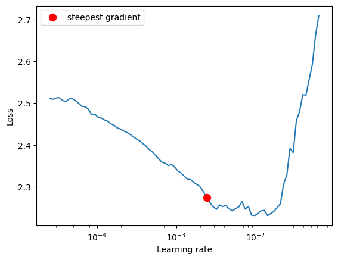
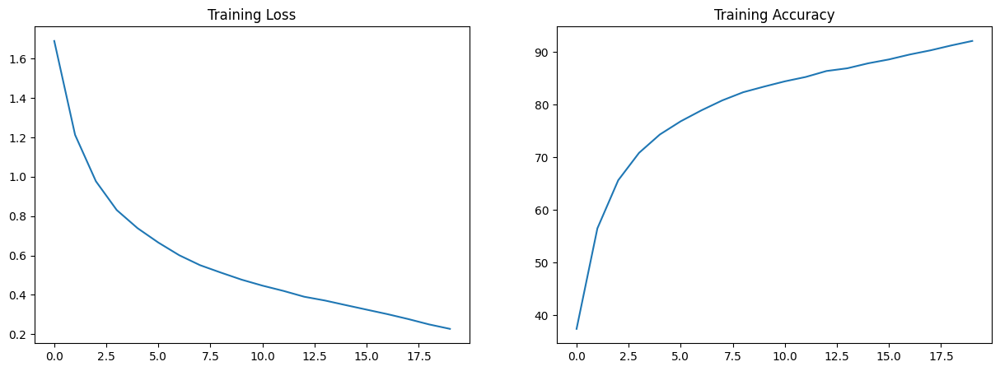
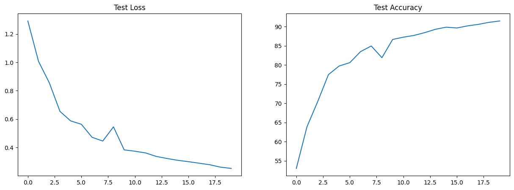
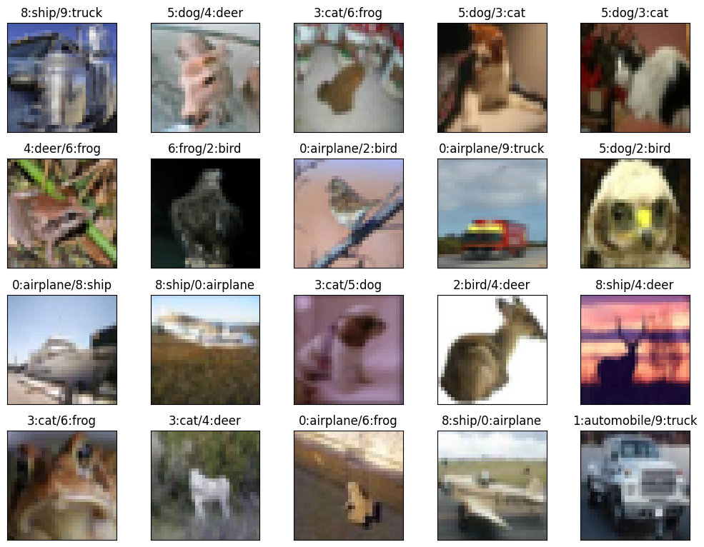
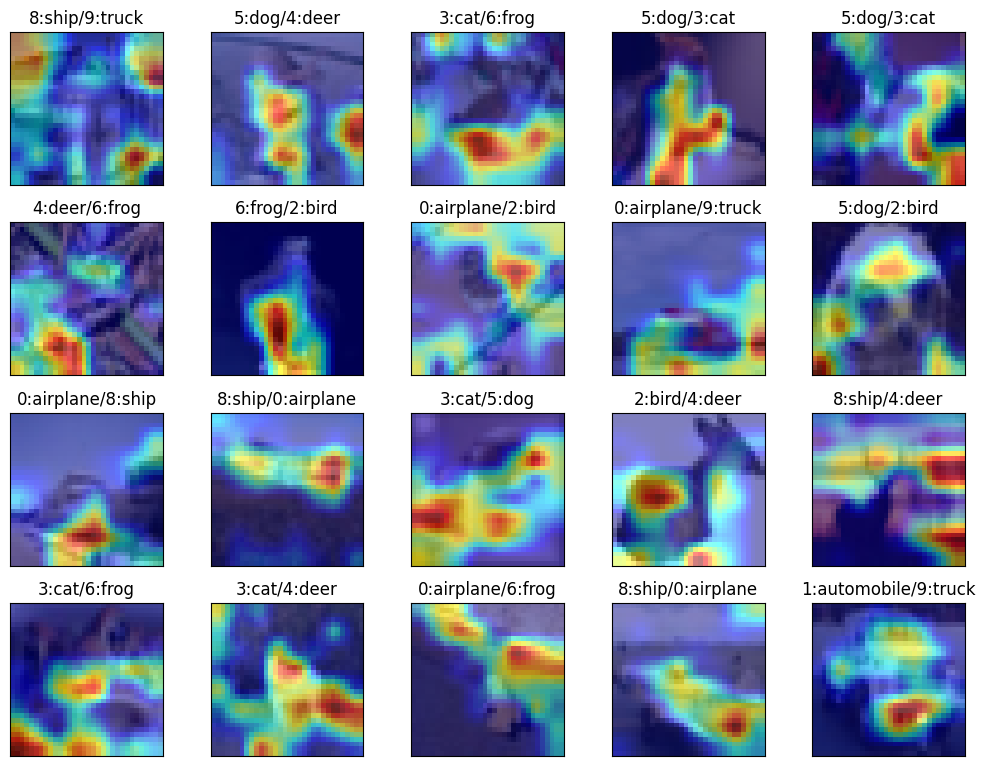

# ERA V1 Session 11

## Code Structure
We are our main repository using our **Main Repo** [**Epoch**](https://github.com/swapniel99/epoch) to import all the necessary code.
Please refer to [this README](https://github.com/swapniel99/epoch/blob/main/README.md) for code structure. 

Our [S11.ipynb](https://github.com/swapniel99/erav1s11/blob/main/S11.ipynb) notebook ONLY contains the following lines of code:

```python
from epoch.main import *  # Invite the gods
cifar10.show_examples()  # Show few examples
print_summary()  # Print model summary
experiment = create_experiment(criterion='crossentropy', epochs=20, scheduler='one_cycle')  # Set up train and test
experiment.execute()  # Perform training
experiment.train.plot_stats()  # Plot train loss graphs
experiment.test.plot_stats()  # Plot test loss graphs
experiment.show_incorrect()  # Show misclassified examples
experiment.show_incorrect(cams=True)  # Show gradcam for misclassified examples
```

We are not defining any new class or function here.

## The Results

Best Train Accuracy: 92.13%

Best Test Accuracy: 91.49%

We import Resnet18 from the main repository and create a new experiment.
We will use SGD Optimizer with One Cycle LR. Here we used LR Finder to get the steepest LR.






Misclassified Images:



GradCAM for misclassified images:

Here we are using channels of size 8x8 from layer 3 of Resnet18 (Because layer 4 gives 4x4 channels)


